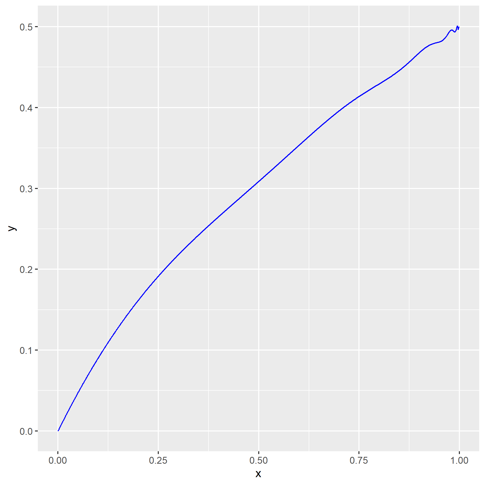
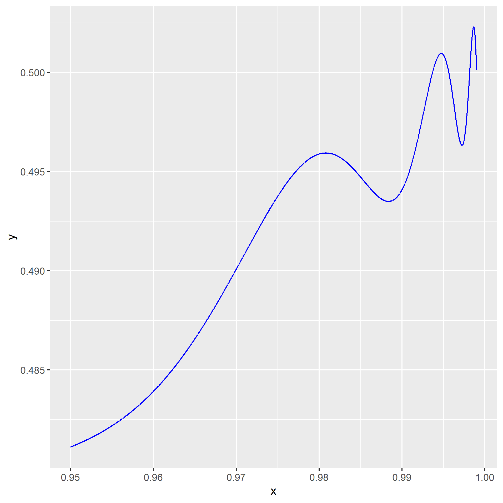
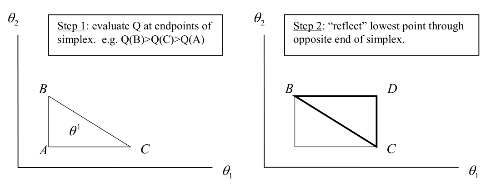
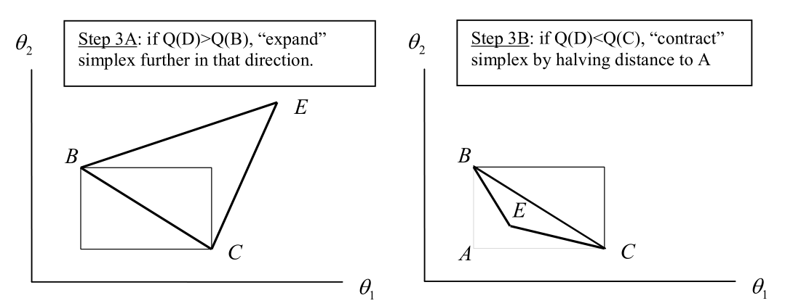
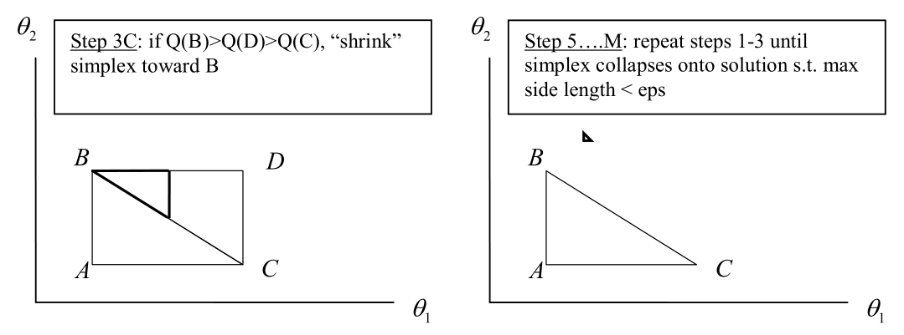
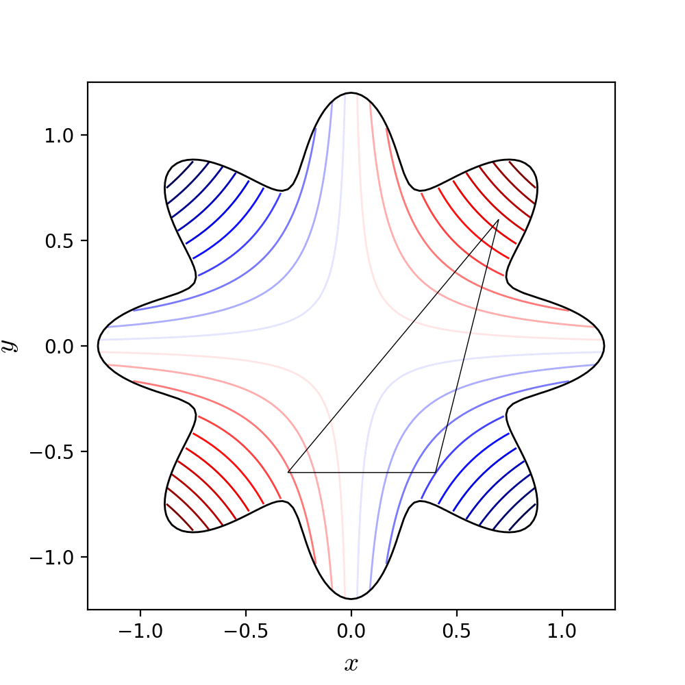

Cameron and Trivedi, Chapter 10

#  Motivation

In a **lot** of applications, we need to find optimal points, i.e. minima or maxima

Virtually in all estimation frameworks we either minimize or maximize something (GMM, MLE, OLS, ..., profits, utility, ....)

The easiest case: we have a continuous differentiable function that is globally concave or convex, so we can find the first derivative, set it to zero and solve

But this is not always feasible! Potential problems:

*  the first derivative=0 can not be solved explicitly for the parameter of interest
*  the function is not globally convex or concave, but has lots of local minima or maxima
*  the function is not differentiable
*  ...

For an arbitrary function mapping from infinite domains like $\mathbb{R}^n$ to $\mathbb{R}$, we have *no idea* 

1. whether there are maximal or minimal points
2. whether those points are unique
3. if they exist, how to find them

A large part of Real analysis is "the theory of finding out" 1) if maxima/minima exist? 2) if are they unique? 3) how can they be found?

### Helpful characteristics

* Bounded functions have suprema/infima, so good chances for minima/maxima
* Continuous functions on bounded intervals have maxima/minima
* For globally concave (convex) functions, we know that if a maximum (minimum) exists it must be unique
* If a function is differentiable and has an optimal point, the derivative must be zero at that point
* etc.

But again, for an arbitrary real-valued function with an unbounded domain

* we have no idea, 
* and we have no way of knowing

Every objective function is unique.

What can be done? 


# Grid search

##  Example 1

Let's set up a grid, an evaluate the function at each point in the grid. Then select the grid point with the highest function value.

$$f(x)=10-(x-1)^2$$

```{r, eval=TRUE, echo=TRUE}
xgrid = seq(-3,3,0.3)
print("Search on grid:")
print(xgrid)
f = function(x){10-(x-1)^2}
y = f(xgrid)
max = which(y==max(y))
plot(xgrid, y, pch=16, ylim=c(-6, 12))
points(xgrid[max], y[max], col="blue", cex=1.1, pch=16)
text(xgrid[max], y[max]-1.5, paste("x:", xgrid[max], "f(x):", y[max]), col="blue")
```


## Example 2

$$f(x) = \sum_{k=0}^{\infty} (-1)^n x^{2^n}$$

Does this function have a unique maximum? Where? Is this function even well-defined over the entire range of $\mathbb{R}$? 
This cannot be easily maximized by setting the first derivative to zero

(Notice that in infinite-horizon problems we frequently sum from 0 to infinity)

It turns out this function is well defined for $|x|<1$. Evaluate the function at all points and find the highest (lowest) value

Hope you do not miss the entire optimal point?

Plotting + visual inspection is always useful


```{r, out.width='50%', fig.cap='', fig.align='center', echo=FALSE}

```

First pass with a coarse grid: maximum is at 0.98.


Zoom in closer to 1:

```{r, out.width='50%', fig.cap='', fig.align='center', echo=FALSE}

```

There seem to be multiple local maxima. Oscillations are happening

Grid-search again, on a finer grid in a neighborhood of 1

The "global" maximum appears to be around 0.9986. 

We found a local max 0.98, but missed a higher local max at 0.9986. Macro problems are often solved like this. Maximize the social welfare function on a grid to find optimal capital, etc.

Another problem with grid search is dimensionality.

What if you need to optimize with respect to 10 parameters? For example: find a set of optimal tax rates (labor income tax, capital income tax, consumption tax, corporate tax, carbon tax,...)

If you have 10 parameters, and you want to try just 10 different values for each parameter, you have $10^{10}=10$ billion parameter combinations to check. And this is not even a fine grid.

> Demo grid search in `demo_num_opt.R`


**BUT** if you need to find only one or two parameters - grid search might be your best bet!

Other options? $\Rightarrow$ **Iterative methods** start by guessing one initial set of parameters $\hat{\theta}_0$, then apply some update rule, and re-estimate $\hat{\theta}_1$, then update again and re-estimate $\hat{\theta}_2$, ... etc.

One class of iterative methods are the gradient methods.


#  Gradient methods

Assume we have an objective function $Q(\theta)$

The objective function is built using a sample of $n$ randomly sampled observations, and shall be minimized with respect to parameters $\theta$ (every maximization can be turned into a minimization problem by multiplying the objective function with -1)

Let $g$ be the gradient of $Q$

**Gradient methods** find points where the gradient of the objective function is zero.

Notice that this method is constructive: Evaluate the gradient $g_t$ of $Q$ at the current guess $\hat{\theta}_t$ and check if the gradient is positive or negative of zero. If it is zero: we already found a local optimum! If it is increasing or decreasing, "follow" the gradient in the "right" direction to decrease the value of the objective function (and ultimately find a minimum). 

"How much" should we follow the gradient in the "right" direction?

**Idea: Find points where the gradient is zero through a Taylor approximation**

Instead of solving  $g(\theta)=0$, we solve the Taylor approximation at $g(\theta)\approx 0$. Assume we are at a current guess $\hat{\theta_t}$. Denote the Hessian matrix of $Q$ by $H$
$$g(\theta)=g(\hat{\theta_t}) + H(\hat{\theta_t})(\theta-\hat{\theta_t})+R \stackrel{!}{=} 0$$

Ignore the remainder term $R$ and solve for $\theta$

$$H^{-1}(\hat{\theta}_t)\left(\underbrace{g(\theta)}_{=0} - g(\hat{\theta}_t)\right) + \hat{\theta}_t \approx \theta$$

$$\theta \approx \hat{\theta_t} - H(\hat{\theta_t})^{-1} g(\hat{\theta_t})$$

Use this equality as an "updating method" to iterate $\hat{\theta_t}$ until we find a $\hat{\theta_t}$ with $g(\hat{\theta_t})=0$

$$\hat{\theta}_{t+1} = \hat{\theta_t} + \underbrace{(- H(\hat{\theta_t})^{-1})}_{=:A_t} g(\hat{\theta_t})$$

> Demo gradient methods, simple examples in `demo_num_opt.R`


More generally: Update the current guess $\hat{\theta}_t$ by building a weighted average between the current guess $\hat{\theta}_{t}$ and the gradient $g$ evaluated at the current guess $\hat{\theta}_t$, using a weighting matrix $A_t$:

$$\hat{\theta}_{t+1} = \hat{\theta}_{t} + A_{t} g_{t}$$ 

denoting $g_t := \left.\frac{\partial Q (\theta)}{\partial \theta}\right|_{\hat{\theta}_t}$

Different ways of calculating the updating matrix $A_t$ $\rightarrow$ different gradient method! If $A=-H^{-1}$, the method is called "Newton Raphson" method

By updating in this way: **Do we actually find a max or min?**

Pick one current guess $\hat{\theta}_{t}$ and an updated guess $\hat{\theta}_{t+1}$. Apply a first-degree Taylor expansion to the objective function $Q$ at $\hat{\theta}_t$:

$$Q(\hat{\theta}_{t+1}) = Q(\hat{\theta}_{t}) + g'_t(\hat{\theta}_{t+1}-\hat{\theta}_t) + R$$

Now plug in the update rule $\hat{\theta}_{t+1} = \hat{\theta}_{t} + A_{t} g_{t}$ into the second term of the Taylor expansion
$$Q(\hat{\theta}_{t+1}) = Q(\hat{\theta}_{t}) + g'_tA_tg_t + R$$

If $A_t$ is negative definite (if $x'A_tx<0$ for all vectors $x \neq 0_k$) then the value of the objective function decreases (approximately) as we update from $\hat{\theta}_t$ to $\hat{\theta}_{t+1}$. If we update with  $A_t=-H^{-1}(\hat{\theta}_t)$, then a positive definite Hessian (convex objective function) means we have a negative definite updating matrix $A_t$. So we are on a good way to find a minimum. If $A_t$ is positive definite we are moving towards a maximum.


##  "Speed" of updating

Look at the updating rule

$$\hat{\theta}_{t+1} = \hat{\theta}_{t} + A_{t} g_{t}$$

If $A_t$ is very "small", then the estimated $\hat{\theta}_t$ updates in very small steps. If $A_t$ is very "large", then each new updated estimate is "very far away" from the previous estimate. This is called "overshooting" versus "undershooting".


##  Step size adjustment

To address this concern, some methods use "step size adjustment" $\lambda_t$ to prevent overshooting/undershooting. Idea: If A is very "large", make $\lambda$ a fraction between 0 and 1.

$$\hat{\theta}_{t+1} = \hat{\theta}_{t} + \hat{\lambda}_t A_{t} g_{t}$$

"Smart" implementation: calculate weights $A$ and gradient $g$ (the computationally difficult part) and then evaluate the objective function for different possible values of $\lambda$ (the computationally easy part), for example

$$Q(\hat{\theta}_t + 0.1A_tg_t), \; Q(\hat{\theta}_t + 0.2A_tg_t), \; Q(\hat{\theta}_t + 0.3A_tg_t), \; ...$$

$\rightarrow$ pick the $\hat{\lambda}$ that gives the lowest value of $Q$ (if you are looking for a minimum)

Notice this "step size adjustment" trick combines the best of two worlds: iterative gradient method + one-dimensional grid search (a.k.a. "line search")


## Practical issues

When do gradient methods work well? 

* If the function has unique optima
* If the starting value / initial guess is "close" to the global optima $\rightarrow$ otherwise you end up at the first-best local optimum

How does your computer know the gradient of a function? Often people only supply one function and say "minimize this"

Some implementations of numerical optimizations allow you to specify the gradient function. If you are able to calculate the gradient (derivative!) of your objective function analytically - do it! and supply it to your optimization problem.

Otherwise your computer has to approximate the gradient numerically in each step and this can slow down your optimization by a lot.


## Simple Example

Exponential regression model, simplest possible case. Need to estimate only one parameter $\beta=\beta_0$

$$y_i = \exp(\beta) + \varepsilon_i$$

Select an appropriate objective function: Want to minimize the sum of squared residuals

$$Q(\beta) = \frac{1}{2n} \sum_i \left(y_i -\exp(\beta) \right)^2$$
The factor $\frac{1}{2n}$ is for computational convenience. No deeper meaning. 

First we need the gradient of the objective function:

$$g(\beta) = \frac{1}{2n} \sum_{i=1}^n 2(y_i - \exp(\beta))(-\exp(\beta)) = -\exp(\beta) \frac{\sum_i (y_i-\exp(\beta))}{n}$$
$$=-\exp(\beta)(\bar{y}-\exp(\beta))$$

What else do we need for applying the Newton-Raphson method? (Update $\hat{\theta}_{t+1} = \hat{\theta_t} - H(\hat{\theta_t})^{-1} g(\hat{\theta_t})$)

Calculate the negative inverted Hessian matrix
$$H(\beta)=-\exp(\beta)(\bar{y}-2\exp(\beta)) \Rightarrow A(\beta) = -H^{-1}(\beta)=\frac{1}{\exp(\beta)(\bar{y}-2\exp(\beta))}$$

Have an ✔ objective function, ✔ a gradient, ✔ a weighting matrix. Ready, let's optimize.

Let's assume $\bar{y}=2$ in the data. Let's start at initial guess $\beta_0=0$

> Demo gradient methods, simple example exponential regression model with randomly generated data in `demo_num_opt.R`


## GMM Example

Look at the dataset `AER::MASchools` Each observation is a public elementary school districts. The variables contain information on district-wide averages for test scores `score4`, student-teacher ratio `stratio`, percent of English learners `english`, and per capita income `income`.

With a simple GMM estimation, we want to find out how test scores are related to per capita income, percent of English learners, and student-teacher ratios in a school district. 

We hypothesize that
$$score_j = \beta_1 \; stratio_j + \beta_2 \; english_j + \beta_3 \; income_j + \varepsilon_j$$

Let's consider the following moment functions that we can use to estimate our coefficients

$$g_{1j}(\beta)=stratio_j \cdot \varepsilon_j, \quad g_{2j}(\beta)=english_j \cdot \varepsilon_j, \quad g_{3j}(\beta)=income_j \cdot \varepsilon_j, \quad g_{4j}(\beta)=income^2_j \cdot \varepsilon_j$$
and build a suitable GMM objective function with weighting matrix $W$. Denote as usual $\bar{g}_1(\beta)=\frac{1}{n}\sum_i g_{1i}(\beta)$ etc.

$$J_n(\beta)=n \bar{G}' W \bar{G}, \quad \bar{G}(\beta)=(\bar{g}_1(\beta),\bar{g}_2(\beta),\bar{g}_3(\beta),\bar{g}_4(\beta))$$

> GMM example `demo_num_opt.R`


## Convergence

Optimization programs (should) stop when the following 3 things hold

* the objective function $Q$ only changes very little with each new iteration
* the gradient is very small
* the change between previous estimate $\theta_t$ and new estimate $\theta_{t+1}$ is very small
**convergence criteria**

$\Rightarrow$ have found a local optimum! Now way of knowing whether this is global *unless* you can prove that the objective function is globally concave

Good practice: set up a coarse grid of possible starting values, run your minimization for each of these possible starting values


## Newton-Raphson method 

Recap the general form of Gradient Methods in finding optimal points numerically. Update the current guess as a weighted average of current guess and the gradient of the objective function evaluated at the current guess.
$$\hat{\theta}_{t+1} = \hat{\theta}_{t} + A_{t} g_{t}$$

When the weighting matrix/updating matrix $A_t=-H^{-1}(\hat{\theta}_t)$, the method is called "Newton-Raphson" method.

$$\hat{\theta}_{t+1} = \hat{\theta}_t - H(\hat{\theta}_t)^{-1}g(\hat{\theta}_t)$$
Newton-Raphson works well on globally convex or globally concave objective functions

>  Newton-Raphson, GMM with gradient methods `demo_num_opt.R`

If you do not specify the gradient function and the Hessian matrix, they will be numerically approximated. This can make your estimation **a lot** slower


## Numerical gradients

If you do not specify a gradient for the objective function, a gradient will be approximated as 
$$g(\hat{\theta}_t) \approx \frac{\Delta Q(\hat{\theta}_t)}{\Delta \theta_j} = \frac{\Delta Q(\hat{\theta}_t + he_j) - Q(\hat{\theta}_t - he_j)}{2h}$$

* $e_j$ - vector that contains zero in all elements except $j$, which is 1
* $h$ - a very small number

Remember this is how derivatives are formally derived? When $h$ converges to zero, the fraction on the left converges to the derivative.

Practical problem: if $h$ is too small, we might run into rounding errors. Computers can only deal with finite calculations.


## DFP Method / Quasi-Newton

(Davidon Fletcher Powell)

The DFP method is a variation of the Newton-Raphson method that does not require 1) knowing the Hessian matrix explicitly and 2) calculating the inverse. Instead, an approximation $A_t$ to the inverse Hessian matrix is obtained using the gradients $g(\hat{\theta}_t)$ and $g(\hat{\theta}_{t-1})$ and the previous $A_{t-1}$.


###  Motivation

Remember that we motivated the gradient methods with setting a Taylor approximation of the gradient to zero instead of setting the true gradient to zero and solving

$$\theta = \hat{\theta_t} - H(\hat{\theta_t})^{-1} g(\hat{\theta_t})$$

This requires us to know the Hessian matrix (analytically or approximated numerically). Notice that the Hessian matrix is the gradient of the gradient. It is just another derivative. Derivatives are limits of secants

$$f'(x) = \lim_{x_t\rightarrow x} \frac{f(x_t)-f(x)}{x_t-x}$$
Idea: Instead of obtaining the Hessian matrix explicitly, we just use analogues to the secants / ratios of the gradient. 

###  Example

Consider the case where the gradient function $g$ and Hessian $H$ are one-dimensional $\mathbb{R} \rightarrow \mathbb{R}$. We replace the Hessian $H(\hat{\theta}_t)$ with the secant between $\hat{\theta}_t$ and the previous $\hat{\theta}_{t-1}$
$$H_{t}\approx \frac{g(\hat{\theta}_t)-g(\hat{\theta}_{t-1})}{(\hat{\theta}_t - \hat{\theta}_{t-1})}$$

In the one dimensional case "inverting the Hessian" simply means flip the ratio and plug in

$$\hat{\theta}_{t+1}=\hat{\theta_t} - \underbrace{ \frac{\hat{\theta}_{t}-\hat{\theta}_{t-1}}{g(\hat{\theta}_{t})-g(\hat{\theta}_{t-1})}}_{=A_t} g(\hat{\theta}_{t})$$

###  Iteration

When the gradient function $g$ is a vector, this expression becomes a bit more complex.

Start with some initial guesses $\hat{\theta}_0$ and $A_0$. $A_0$ can for example be the identity matrix. Then proceed to update $A$ and $\hat{\theta}$ in each step, using only gradients and differences. 

First update $\hat{\theta}_t$, evaluate $g$ at $\hat{\theta}_t$
$$\hat{\theta}_{t+1} = \hat{\theta}_t + \underbrace{(-A_tg(\hat{\theta}_t))}_{=:step}$$

Denote $step := -A_t g(\hat{\theta}_t)$ and $g_{diff} := g(\hat{\theta}_{t+1}) - g(\hat{\theta}_{t})$

$$A_{t+1} = A_t + \frac{step \cdot step'}{step' \cdot g_{diff}} + \frac{A_t \cdot g_{diff} \cdot g_{diff}' \cdot A_t}{g_{diff}'\cdot A_t \cdot g_{diff}}$$ 


If $A_0$ is positive definite, all following updated $A_t$ will be positive definite.

It can be shown that $A_t$ converges to $-H^{-1}$ / to the Raphson Newton method.

For applications, check `R::optim` package https://www.rdocumentation.org/packages/stats/versions/3.6.2/topics/optim


##  Refinement: BFGS Method

The BFGS method is a refinement of the DFP method with a different method for iterating on the approximation $A_t$ to the inverse Hessian matrix.

Start with identity matrix $A_1=I$

$$A_{t+1} = \left(I-\frac{step \cdot g'_{diff}}{g'_{diff} \cdot step}\right) A_t \left(I-\frac{g_{diff} \cdot step'}{g'_{diff} \cdot step}\right) + \frac{step \cdot step'}{g'_{diff} \cdot step}$$ 

> DFP and BFGS method `demo_num_opt.R`


## BHHH method

The Berndt-Hall-Hall-Hausman method is a gradient method that can be used for objective functions that are of the functional form $Q(\theta)=\sum_i q_i(\theta)$ for some $q$. Notice that GMM objective functions are not of that form (why?) 

But for example MLE objective functions are of the form $Q(\theta)=\sum_i \log(f_i(\theta))$, where $f_i$ is individual $i$'s density function. Then the update rule $\hat{\theta}_{t+1} = \hat{\theta}_{t} + A_{t} g(\hat{\theta}_t)$ is used with 

$$A_t=-H^{-1}_{BHHH,t}$$

and

$$H_{BHHH} = -\sum_i \left. \frac{\partial q_i}{\partial \theta} \frac{\partial q'_i}{\partial \theta}\right|_{\hat{\theta}_t}$$

The Hessian is approximated by a sum over the outer products of individual gradients.

Pro: need only first derivatives, no need to calculate true Hessian matrix.

Methods where the Hessian is approximated / does not need to be computed are also called **quasi-Newton methods**

The problem with Hessian matrices is that obtaining them through approximation in each step is computationally expensive, especially if there are many parameters $\rightarrow$ high dimensional Hessian matrices + this has to be repeated in *every* update.

When the objective function does not have continuous derivatives (gradients), these methods might still not deliver good results.


#  Non-gradient methods

Non-gradient methods do not rely on gradients to find optimal points. You only need to evaluate the objective function.


##  Nelder Mead

Suppose we want to minimize a real-valued objective function $Q:\mathbb{R}^n\rightarrow\mathbb{R}$. This method is appropriate for $n\geq 2$. 

### Idea
Iteratively update a simplex ($\approx$ "a set of points") to find increasingly "better" points. Systematically find new points and throw out old points. A formal definition of a simplex is given here for completeness. (Take a set of affine independent vectors in $\mathbb{R}^n$, connect the dots)

> Let $k \in \mathbb{N}$. A set of elements $v_0,...,v_k \in \mathbb{R}^n$ is called affine independent if for all sets of scalars $t_0,...,t_k \in \mathbb{R}$, $t_0v_0+...+t_kv_k=0$ implies that $t_0=...=t_k=0$. Let $v_0,...,v_k$ be affine independent elements of $\mathbb{R}^n$. A simplex in $\mathbb{R}^n$ is a set 
$$\Delta = \{x \in \mathbb{R}^n | \exists \; t_0,...,t_k \in [0,1]: \sum_{i=0}^k t_i=1 \land x=\sum_{i=0}^k t_i v_i\}$$

Illustrative example: A triangle is a simplex in $\mathbb{R}^2$.

### Algorithm
Start with $n+1$ points (vertices) $\theta_1,...,\theta_{n+1}$. Define 4 different parameters

* reflection $\rho>0$
* expansion $\chi>1$, $\chi>\rho$
* contraction $\gamma \in (0,1)$
* shrinkage $\sigma \in (0,1)$

Evaluate the objective function at the chosen $n+1$ points. Order the points such that
$$Q\left(\theta_{(1)}\right)\leq Q\left(\theta_{(2)}\right)\leq ...\leq Q\left(\theta_{(n+1)}\right)$$
Construct the centroid of the best $n$ points $\theta^*=\frac{1}{n}\sum_{i=1}^n \theta_{(i)}$ and use it to construct the reflection point $\theta_r=(1+\rho)\theta^*-\rho\theta_{(n+1)}$ to move away from the worst point. 
Evaluate $Q$ at $\theta_r$. There are the following scenarios:

1. If $Q(\theta_r)<Q(\theta_{(1)})$ $\Rightarrow$ expand to improve even more. Construct $\theta_e=(1+\rho\chi)\theta^*-\rho\chi \theta^*$
    + If $Q(\theta_e)<Q(\theta_r)$, add $\theta_e$ to the set of points and drop $\theta_{(n+1)}$
    + If $Q(\theta_r)<Q(\theta_e)$, add $\theta_r$ to the set of points and drop $\theta_{(n+1)}$
2. If $Q(\theta_{(1)})\leq Q(\theta_r)<Q(\theta_{(n)})$ $\Rightarrow$ add $\theta_r$ to the set of points and drop $\theta_{(n+1)}$
3. If $Q(\theta_{(n)})\leq Q(\theta_r)<Q(\theta_{(n+1)})$ $\Rightarrow$ contract back a bit towards the centroid. Construct $\theta_c=(1+\rho\gamma)\theta^*-\rho\gamma \theta_{(n+1)}$
    + If $Q(\theta_c)<Q(\theta_r)$, add $\theta_c$ and drop $\theta_{(n+1)}$
    + If $Q(\theta_c) \geq Q(\theta_r)$ shrink all points $\theta_{(2)},...,\theta_{(n+1)}$ towards $\theta_{(1)}$ using $\tilde{\theta}_2=\sigma\theta_{(1)}+(1-\sigma)\theta_{(2)}$,..., $\tilde{\theta}_{n+1}=\sigma\theta_{(1)}+(1-\sigma)\theta_{(n+1))}$ and proceed with the set $\theta_{(1)},\tilde{\theta}_2,...,,\tilde{\theta}_{n+1}$
4. If $Q(\theta_r)\geq Q(\theta_{(n+1)})$ $\Rightarrow$ allow a contraction towards the worst point. Construct $\theta_c=(1-\gamma)\theta^*+\gamma \theta_{(n+1)}$
    + If $Q(\theta_c)<Q(\theta_{(n+1)})$, add $\theta_c$ and drop $\theta_{(n+1)}$. 
    + If $Q(\theta_c)\geq Q(\theta_{(n+1)})$, shrink all points $\theta_{(2)},...,\theta_{(n+1)}$ towards $\theta_{(1)}$ using $\tilde{\theta}_2=\sigma\theta_{(1)}+(1-\sigma)\theta_{(2)}$,..., $\tilde{\theta}_{n+1}=\sigma\theta_{(1)}+(1-\sigma)\theta_{(n+1))}$ and proceed with the set $\theta_{(1)},\tilde{\theta}_2,...,,\tilde{\theta}_{n+1}$


### Illustration 1

```{r, echo = FALSE, out.width='80%', fig.align='center'}
  
  
  
```
Source: Econometrics II ECN726 Kuminoff


### Illustration 2

Test function $f(x,y)=0.1xy$, subject to $x^2+y^2\leq (1+0.2 \cos(8 \arctan(x/y)))^2$

```{r trees_gif, echo = FALSE, out.width='40%', fig.align='center'}
if (knitr::is_html_output()){
  
} else {
  message("GIF of the Nelder-Mead algorithm minimizing the Simionescu function")
}
```

Source: nicoguaro - CC BY-SA 4.0, https://commons.wikimedia.org/w/index.php?curid=53418011

#  Generative methods

Generative methods are methods that search randomly. For example, they pick randomly how far to search in a given direction.

##  Simulated annealing

Reference: Belisle 1992

Suppose we want to *maximize* an objective function $Q$

This method searches 1) in random directions on the parameter space, and 2) randomly allows moves in the "wrong" direction. Therefore you might get slightly different results when you run it more than once. 

First, specify a maximum step length $\lambda_j$ and a "temperature" $T$. 

Then, draw a random number $r_j$ from a uniform distribution on $(-1,1)$. Update your current guess. $e_j$ is the vector that has only zero elements, except the $j$th element that is 1.

$$\hat{\theta}^*_{t} = \hat{\theta}_t + \lambda_j r_j e_j$$
Then evaluate the objective function $Q(\hat{\theta}_{t+1})$. If $Q(\hat{\theta}^*_{t})>Q(\hat{\theta}_{t})$ then keep the update $\hat{\theta}_{t+1}=\hat{\theta}^*_{t}$. If it does not increase the objective function, randomly draw $u$ from a uniform distribution $u \in (0,1)$. Keep the update if the decrease is "not too much". 

$$\exp\left(\frac{Q(\hat{\theta}^*_{t})-Q(\hat{\theta}_{t})}{T}\right)>u$$

Question: What is the benefit of randomly allowing decreases?


#  Examples of functions to optimize over

https://en.wikipedia.org/wiki/Test_functions_for_optimization

Some functional form is not unlike functions we frequently see in estimations! "Linear regression" with some higher order polynomial terms and interactions $\rightarrow$ easily get objective functions that are not globally concave

